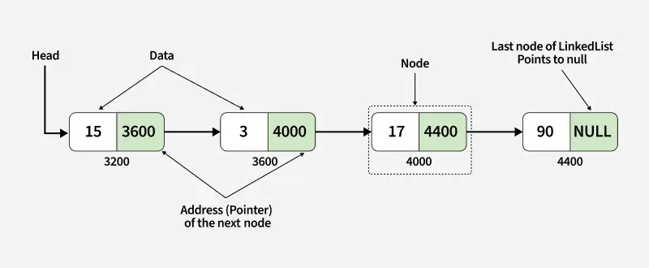

# 4.4 Linked Lists in Java

<!-- TOC -->

* [4.4 Linked Lists in Java](#44-linked-lists-in-java)
    * [📘 Concept](#-concept)
    * [🚩 Key Points](#-key-points)
    * [🧠 Use Cases (Real-World & Interviews)](#-use-cases-real-world--interviews)
    * [📚 Types](#-types)
    * [✏️ Java Code Examples](#-java-code-examples)
        * [Singly Linked List (Custom Implementation)](#singly-linked-list-custom-implementation)
        * [Java’s Built-in `LinkedList`](#javas-built-in-linkedlist)
    * [✅ Summary](#-summary)
    * [❓ Common Interview Questions](#-common-interview-questions)
    * [🧠 Tips for Interviews](#-tips-for-interviews)
    * [Singly Linked List](#singly-linked-list)
        * [1. Traversal of Singly Linked List](#1-traversal-of-singly-linked-list)
        * [2. Searching in Singly Linked List](#2-searching-in-singly-linked-list)
        * [3. Length of Singly Linked List](#3-length-of-singly-linked-list)
        * [4. Insertion in Singly Linked List](#4-insertion-in-singly-linked-list)

<!-- TOC -->

---

Linked list is a linear data structure that stores data in nodes, which are connected by pointers. Unlike arrays, nodes
of linked lists are not stored in contiguous memory locations and can only be accessed sequentially, starting from the
head of list.



**Linked List:**

- **Data Structure**: Non-contiguous
- **Memory Allocation**: Typically allocated one by one to individual elements
- **Insertion/Deletion**: Efficient
- **Access**: Sequential

## 📘 Concept

A **Linked List** is a linear data structure where elements (called nodes) are stored in memory using pointers, not
contiguous memory locations.

Each node contains:

- Data (the value)
- Reference (or pointer) to the next node

In Java, a Linked List can be singly or doubly linked, and Java provides `LinkedList` as a built-in implementation of
the List interface.

## 🚩 Key Points

- Dynamic size (unlike arrays)
- Efficient insertions/deletions (O(1) at head or known position)
- Slower access time (O(n) for element access by index)
- Can be **Singly**, **Doubly**, or **Circularly** linked

## 🧠 Use Cases (Real-World & Interviews)

- Undo functionality (Doubly Linked List)
- Browser history navigation
- Implementing stacks and queues
- Dynamic memory allocation
- Solving interview problems like reversing a list, cycle detection, merging sorted lists

## 📚 Types

- **Singly Linked List**: each node points to the next
- **Doubly Linked List**: each node points to both previous and next
- **Circular Linked List**: last node points to head (can be singly or doubly)

---

## ✏️ Java Code Examples

### Singly Linked List (Custom Implementation)

```java
class Node {
    int data;
    Node next;

    Node(int data) {
        this.data = data;
        this.next = null;
    }
}

public class SinglyLinkedList {
    Node head;

    // Add to end
    public void append(int data) {
        Node newNode = new Node(data);
        if (head == null) {
            head = newNode;
            return;
        }
        Node current = head;
        while (current.next != null) {
            current = current.next;
        }
        current.next = newNode;
    }

    // Print list
    public void printList() {
        Node current = head;
        while (current != null) {
            System.out.print(current.data + " -> ");
            current = current.next;
        }
        System.out.println("null");
    }
}
```

### Java’s Built-in `LinkedList`

```java
import java.util.LinkedList;

public class BuiltInLinkedListExample {
    public static void main(String[] args) {
        LinkedList<String> list = new LinkedList<>();
        list.add("A");
        list.add("B");
        list.addFirst("Start");
        list.addLast("End");

        for (String item : list) {
            System.out.println(item);
        }
    }
}
```

---

## ✅ Summary

| Feature       | ArrayList     | LinkedList          |
|---------------|---------------|---------------------|
| Access        | O(1)          | O(n)                |
| Insertion/Del | O(n)          | O(1) (at known pos) |
| Memory        | Less overhead | More overhead       |
| Use case      | Read-heavy    | Write-heavy         |

---

## ❓ Common Interview Questions

1. Reverse a linked list (iteratively and recursively)
2. Detect and remove a cycle (Floyd’s algorithm)
3. Merge two sorted linked lists
4. Find the middle of the linked list
5. Remove the N-th node from the end
6. Check if a linked list is a palindrome
7. Intersection point of two linked lists

---

## 🧠 Tips for Interviews

- Practice both **iteration** and **recursion**.
- Know how to use **two pointers** technique.
- Be clear with **edge cases**: empty list, single node, cycle detection.

---

## Singly Linked List

A singly linked list is a fundamental data structure, it consists of nodes where each node contains a data field and a
reference to the next node in the linked list. The next of the last node is null, indicating the end of the list. Linked
Lists support efficient insertion and deletion operations.

**Understanding Node Structure**

In a singly linked list, each node consists of two parts: data and a pointer to the next node. This structure allows
nodes to be dynamically linked together, forming a chain-like sequence.


**Code:**

```java
// Definition of a Node in a singly linked list
public class Node {
    int data;
    Node next;

    // Constructor to initialize the node with data
    public Node(int data) {
        this.data = data;
        this.next = null;
    }
}
```

### 1. Traversal of Singly Linked List

Traversal in a linked list means visiting each node and performing operations like printing or processing data.

Time Complexity: $O(n)$ - You must visit every node in the worst-case scenario.

**Step-by-step approach:**

1) Initialize a pointer (current) to the head of the list.
2) Loop through the list using a while loop until current becomes NULL.
3) Process each node (e.g., print its data).
4) Move to the next node by updating current = current->next.

```java
/**
 * 1. Traversal of Singly Linked List
 * Prints all the elements in the list from head to tail.
 * Time Complexity: O(n)
 */
public void printList() {
    Node current = this.head;
    System.out.print("Singly Linked List: ");
    while (current != null) {
        System.out.print(current.data + " -> ");
        current = current.next;
    }
    System.out.println("null");
}
```

### 2. Searching in Singly Linked List

Searching in a Singly Linked List refers to the process of looking for a specific element or value within the elements
of the linked list.

Time Complexity: $O(n)$ - In the worst-case, you may have to scan the entire list to find or confirm the absence of an
element.

**Step-by-step approach:**

1) Start from the head of the linked list.
2) Check each node’s data:
    - If it matches the target value, return true (element found).
    - Otherwise, move to the next node.
3) Repeat until the end (NULL) is reached.
4) If no match is found, return false.

```java
/**
 * 2. Searching in Singly Linked List
 * Searches for a specific value in the list.
 * @param value The value to search for.
 * @return true if the value is found, false otherwise.
 * Time Complexity: O(n)
 */
public boolean search(int value) {
    Node current = this.head;
    while (current != null) {
        if (current.data == value) {
            return true;
        }
        current = current.next;
    }
    return false;
}
```

### 3. Length of Singly Linked List

Finding the length of a Singly Linked List means counting the total number of nodes.

**Step-by-step approach:**

1) Initialize a counter (length = 0).
2) Start from the head, assign it to current.
3) Traverse the list:
    - Increment length for each node.
    - Move to the next node (current = current->next).
4) Return the final length when current becomes NULL.

```java
/**
 * 3. Length of Singly Linked List
 * Counts the number of nodes in the list.
 * @return The number of nodes.
 * Time Complexity: O(n)
 */
public int length() {
    int count = 0;
    Node current = this.head;
    while (current != null) {
        count++;
        current = current.next;
    }
    return count;
}
```

### 4. Insertion in Singly Linked List

Insertion is a fundamental operation in linked lists that involves adding a new node to the list. There are several
scenarios for insertion:

**a) Insertion at the Beginning of Singly Linked List:** Insertion at the beginning involves adding a new node before
the
current head, making it the new head.

**Step-by-step approach:**

1) Create a new node with the given value.
2) Set the next pointer of the new node to the current head.
3) Move the head to point to the new node.
4) Return the new head of the linked list.


```java
/**
 * Inserts a new node at the beginning of the list.
 * @param data The data for the new node.
 * Time Complexity: O(1)
 */
public void insertAtBeginning(int data) {
    Node newNode = new Node(data);
    newNode.next = this.head;
    this.head = newNode;
}
```

**b. Insertion at the End of Singly Linked List:** To insert a node at the end of the list, traverse the list until the
last node is reached, and then link the new node to the current last node

**Step-by-step approach:**

1) Create a new node with the given value.
2) Check if the list is empty:
    - If it is, make the new node the head and return.
3) Traverse the list until the last node is reached.
4) Link the new node to the current last node by setting the last node's next pointer to the new node.


```java
/**
 * 4. Insertion in Singly Linked List
 * Inserts a new node at the end of the list.
 * @param data The data for the new node.
 * Time Complexity: O(n)
 */
public void insertAtEnd(int data) {
    Node newNode = new Node(data);

    // If the list is empty, the new node becomes the head.
    if (this.head == null) {
        this.head = newNode;
        return;
    }

    // Traverse to the last node
    Node current = this.head;
    while (current.next != null) {
        current = current.next;
    }
    // Link the new node to the last node
    current.next = newNode;
}
```

**c) c. Insertion at a Specific Position of the Singly Linked List:**
To insert a node at a specific position, traverse the list to the desired position, link the new node to the next node,
and update the links accordingly.

**Step-by-step approach:**

1) Create a new node and assign it a value.
2) If inserting at the beginning (position = 1):
    - Point the new node’s next to the current head.
    - Update the head to the new node.
    - Return (Insertion done).
3) Otherwise, traverse the list:
    - Start from the head and move to the (position - 1)ᵗʰ node (just before the desired position).
    - If the position is beyond the list length, return an error or append at the end.
4) Insert the new node:
    - Point the new node’s next to the next node of the current position.
    - Update the previous node’s next to the new node.
5) Return the updated list.


```java
/**
 * Inserts a new node at a specific position in the list.
 * @param data The data for the new node.
 * @param position The position (0-indexed) where the new node should be inserted.
 * Time Complexity: O(n)
 */
public void insertAtPosition(int data, int position) {
    // 1. Handle edge case: inserting at the beginning (position 0)
    if (position == 0) {
        insertAtBeginning(data);
        return;
    }

    // 2. Handle invalid position
    if (position < 0) {
        System.out.println("Invalid position. Position cannot be negative.");
        return;
    }

    Node newNode = new Node(data);
    Node current = this.head;
    int count = 0;

    // 3. Traverse to the node just before the desired position
    while (current != null && count < position - 1) {
        current = current.next;
        count++;
    }

    // 4. Handle edge case: position is out of bounds
    if (current == null) {
        System.out.println("Position out of bounds. The list is not long enough.");
        return;
    }

    // 5. Perform the insertion
    newNode.next = current.next; // New node's next points to the next node of the current node
    current.next = newNode;      // Current node's next points to the new node
}
```

### 5. Deletion in Singly Linked List

Deletion involves removing a node from the linked list. Similar to insertion, there are different scenarios for
deletion:

**a. Deletion at the Beginning of Singly Linked List:** To delete the first node, update the head to point to the second
node in the list.

**Steps-by-step approach:**

- Check if the head is NULL.
    - If it is, return NULL (the list is empty).
- Store the current head node in a temporary variable temp.
- Move the head pointer to the next node.
- Delete the temporary node.
- Return the new head of the linked list.


```java
/**
 * 5a. Deletion at the Beginning of Singly Linked List
 * Deletes the first node (head) of the list.
 * Time Complexity: O(1)
 */
public void deleteAtBeginning() {
    if (this.head == null) {
        System.out.println("List is empty. Nothing to delete.");
        return;
    }
    Node temp = this.head; // Store head node to delete later
    this.head = this.head.next; // Move head to the next node
    temp.next = null; // Detach the node from the list
}
```

**b. Deletion at the End of Singly Linked List:** To delete the last node, traverse the list until the second-to-last
node and update its next field to None.

**Steps-by-step approach:**

- Check if the head is NULL.
    - If it is, return NULL (the list is empty).
- Store the current head node in a temporary variable temp.
- Move the head pointer to the next node.
- Delete the temporary node.
- Return the new head of the linked list.


```java
/**
 * 5b. Deletion at the End of Singly Linked List
 * Deletes the last node (tail) of the list.
 * Time Complexity: O(n)
 */
public void deleteAtEnd() {
    if (this.head == null) {
        System.out.println("List is empty. Nothing to delete.");
        return;
    }
    // Case: Only one node in the list
    if (this.head.next == null) {
        this.head = null;
        return;
    }
    // Traverse to the second last node
    Node current = this.head;
    while (current.next.next != null) {
        current = current.next;
    }
    // Delete the last node
    current.next = null;
}
```

**c. Deletion at a Specific Position of Singly Linked List:** To delete a node at a specific position, traverse the list
to the desired position, update the links to bypass the node to be deleted.

**Step-by-step approach:**

- Check if the list is empty or the position is invalid, return if so.
- If the head needs to be deleted, update the head and delete the node.
- Traverse to the node before the position to be deleted.
- If the position is out of range, return.
- Store the node to be deleted.
- Update the links to bypass the node.
- Delete the stored node.


```java
/**
 * 5c. Deletion at a Specific Position of Singly Linked List
 * Deletes the node at the given position (0-indexed).
 * @param position The position of the node to delete.
 * Time Complexity: O(n)
 */
public void deleteAtPosition(int position) {
    if (this.head == null) {
        System.out.println("List is empty. Nothing to delete.");
        return;
    }
    // Handle invalid positions
    if (position < 0) {
        System.out.println("Invalid position. Position cannot be negative.");
        return;
    }
    // Case: Delete head node (position 0)
    if (position == 0) {
        deleteAtBeginning();
        return;
    }
    Node current = this.head;
    int count = 0;
    // Traverse to the node before the target position
    while (current != null && count < position - 1) {
        current = current.next;
        count++;
    }
    // Check if position is out of bounds
    if (current == null || current.next == null) {
        System.out.println("Position out of bounds.");
        return;
    }
    // Bypass the node to delete
    current.next = current.next.next;
}
```

### 6. Modify a Singly Linked List

Updating in a Singly Linked List means modifying the value of a node at a given position.

**Step-by-step approach:**

- Start from the head of the list.
- Traverse to the required position (move current node to position).
- Check if the position is valid:
    - If the position is out of bounds, return an error.
- Update the node’s data with the new value.
- Return the modified list.

```java
/**
 * 6. Modify a Singly Linked List
 * Updates the value of a node at a given position (0-indexed).
 *
 * @param position The position of the node to modify.
 * @param newData  The new data to set.
 *                 Time Complexity: O(n)
 */
public void modify(int position, int newData) {
    if (position < 0 || this.head == null) {
        System.out.println("Invalid position or list is empty.");
        return;
    }

    Node current = this.head;
    int count = 0;

    while (current != null && count < position) {
        current = current.next;
        count++;
    }

    if (current != null) {
        current.data = newData;
    } else {
        System.out.println("Position out of bounds.");
    }
}
```

### 7. Reversing a Singly Linked List

Reversing a singly linked list means changing the direction of pointers so that the last node becomes the new head.

**Step-by-step approach:**

- Initialize three pointers:
    - prev = NULL (to track the previous node)
    - current = head (starting point)
    - next = NULL (to store the next node temporarily)
- Iterate through the list:
    - Store next = current->next (save next node).
    - Reverse the link: current->next = prev.
    - Move prev and current forward (prev = current, current = next).
- Update head to prev (new head is the last node).

```java
/**
 * 7. Reversing a Singly Linked List
 * Reverses the list iteratively.
 * Time Complexity: O(n)
 */
public void reverse() {
    Node previous = null;
    Node current = this.head;
    Node next = null;

    while (current != null) {
        next = current.next; // Store the next node
        current.next = previous; // Reverse the current node's pointer
        previous = current; // Move previous one step forward
        current = next; // Move current one step forward
    }
    this.head = previous; // The new head is the last node of the original list
}
```
